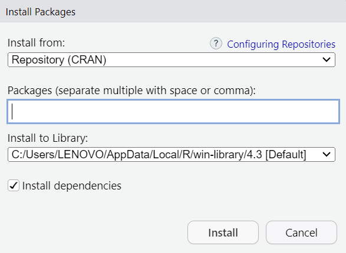

# Functions and packages

As you embark on your R programming journey, understanding and utilizing functions and packages will be instrumental in your success. These powerful tools will empower you to tackle complex data analysis tasks, create insightful visualizations, and develop innovative applications. Embrace the world of functions and packages, and unlock the boundless possibilities of R.

## R flow control

When you run code, R executes statements in the order in which they appear on the page, from top to bottom. Programming languages like R let you change the order in which code executes, which allows you to skip certain statements or run certain statements over and over again. Programming constructs that let you alter the order in which code executes are known as control flow statements. In R programming, there are many types of control statements and the most popular are: `if condition`, `if-else condition`, `for loop`, `while loop`.

* if condition: This control structure checks the expression provided in parenthesis is true or not. If true, the execution of the statements in braces {} continues. 
Syntax:

        if(expression){
          statements
          ....
        }
        
Example:
```{r}
x <- 100

if(x > 10){ 
  print(paste(x, "is greater than 10"))
}
```


* if-else condition:It is similar to if condition but when the test expression in if condition fails, then statements in else condition are executed.
Syntax:

        if (expression) {
          statements
          ....
        } else {
          statements
          ....
        }

Example:
```{r}
x <- 5

# Check value is less than or greater than 10 
if(x > 10){ 
  print(paste(x, "is greater than 10")) 
}else{ 
  print(paste(x, "is less than 10")) 
}
```
* for loop: It is a type of loop or sequence of statements executed repeatedly until exit condition is reached.
Syntax:
        for (value in vector) {
        statements
        ....
        }
Example:
```{r}
x <- letters[3:5] 

for(i in x){ 
  print(i) 
}
```
* while loop: while loop is another kind of loop iterated until a condition is satisfied. The testing expression is checked first before executing the body of loop.
Syntax:
        while(expression) {
        statement
        ....
        }
Example:
```{r}
x = 3

# Print 1 to 5 
while(x <= 5){ 
  print(x) 
  x = x + 1
}
```

## Functions

A function is a set of statements organized together to perform a specific task. They are useful when you want to perform a certain task multiple times.

An R function is created by using the keyword `function`. The basic syntax of an R function definition is as follows:

        function_name <- function(arg_1, arg_2,..) 
                            function body
        }
        
Example1 : Single Input Single Output

```{r}
# A simple R function to calculate 
# area of a circle
 
areaOfCircle = function(radius){
  area = pi*radius^2
  return(area)
}
 
print(areaOfCircle(2))

```

Example 2: Multiple Input Multiple Output

```{r}

# A simple R function to calculate area and perimeter of a rectangle
 
Rectangle = function(length, width){
  area = length * width
  perimeter = 2 * (length + width)
   
  # create an object called result which is a list of area and perimeter
  result = list("Area" = area, "Perimeter" = perimeter)
  return(result)
}
 
resultList = Rectangle(2, 3)
print(resultList["Area"])
print(resultList["Perimeter"])

```

Example 3: Inline Function

```{r}
# A simple R program to demonstrate the inline function

f = function(x) x^2*4+x/3

print(f(4))
print(f(-2))
print(0)

```

Example 4: Function without an Argument

```{r}
# Generate a random number between 0 and 1
generate_random_number <- function() {
  
  random_number <- runif(1)
  
  return(random_number)
}
```

        
### Function Components {-}
The different parts of a function are:

+ Function Name: This is the actual name of the function. It is stored in R environment as an object with this name.

+ Arguments: An argument is a placeholder. When a function is invoked, you pass a value to the argument. Arguments are optional; that is, a function may contain no arguments. Also arguments can have default values.

+ Function Body: The function body contains a collection of statements that defines what the function does.

+ Return Value: The return value of a function is the last expression in the function body to be evaluated.

R has many in-built functions which can be directly called in the program without defining them first. We can also create and use our own functions referred as user defined functions.

### Built-in Function {-}
Built-in Function are the functions that are already existing in R language and you just need to call them to use.

There are several predefined functions, such as mathematical functions (`abs()`,`sqrt()`,`exp()`,...), statistical functions (`mean()`, `median()`, `cor()`,...), data manipulation functions (`aggregate()`,`subset()`,`order()`,...) and file input/output functions (`read.csv()`,`write.csv()`,`readRDS()`,...).

## Packages
Packages in R Programming language are a set of R functions, compiled code, and sample data. These are stored under a directory called “library” within the R environment. By default, R installs a group of packages during installation. Once we start the R console, only the default packages are available by default. Other packages that are already installed need to be loaded explicitly to be utilized by the R program that’s getting to use them. 

### Repositories {-}
A repository is a place where packages are located and stored so you can install R packages from it. Organizations and Developers have a local repository, typically they are online and accessible to everyone. Some of the most popular repositories for R packages are: 

+ CRAN: Comprehensive R Archive Network(CRAN) is the official repository, it is a network of FTP and web servers maintained by the R community around the world. The R community coordinates it, and for a package to be published in CRAN, the Package needs to pass several tests to ensure that the package is following CRAN policies.

        install.packages("package_name")

+ Bioconductor: Bioconductor is a topic-specific repository, intended for open source software for bioinformatics. Similar to CRAN, it has its own submission and review processes, and its community is very active having several conferences and meetings per year in order to maintain quality.
To download with this repository you have to install fist the **BiocManager** package and then run:

      BiocManager::install("package_name")
        
+ Github: Github is the most popular repository for open-source projects. It’s popular as it comes from the unlimited space for open source, the integration with git, a version control software, and its ease to share and collaborate with others.
To install an R packages from GitHub first, you need to install devtools by running the following code: 

        install.packages("devtools")

Once devtools is installed, we can use the install_github() function to install an R package from GitHub. The syntax is:

        devtools::install_github("github_username/github_repo")

We can also install packages in RStudio manually:
In R Studio go to Tools -> Install Package, and there we will get a pop-up window to type the package you want to install:

<p style="text-align: center"></p>

### How to Load Packages in R Programming Language {-}

When a R package is installed, we are ready to use its functionalities. If we just need a sporadic use of a few functions or data inside a package we can access them with the following notation.
We can use library() or require() to load packages.
```{r echo = T, results = 'hide'}
library(stats)
require(stats)
```
        
To load more than one package at a time:
```{r}
library(caret, ggplot2)
```


