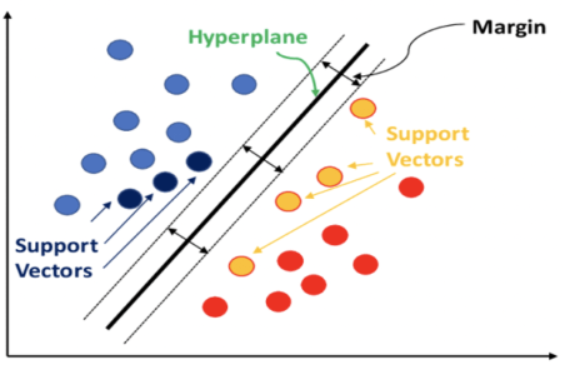
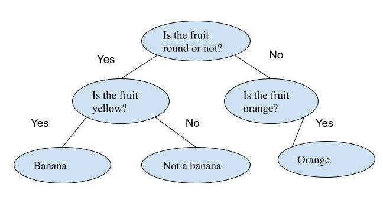
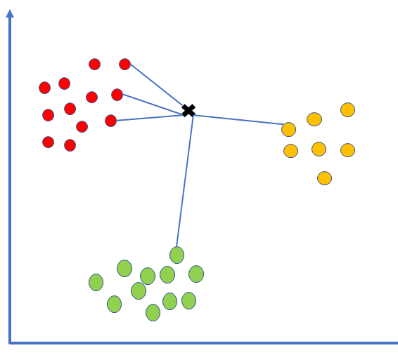
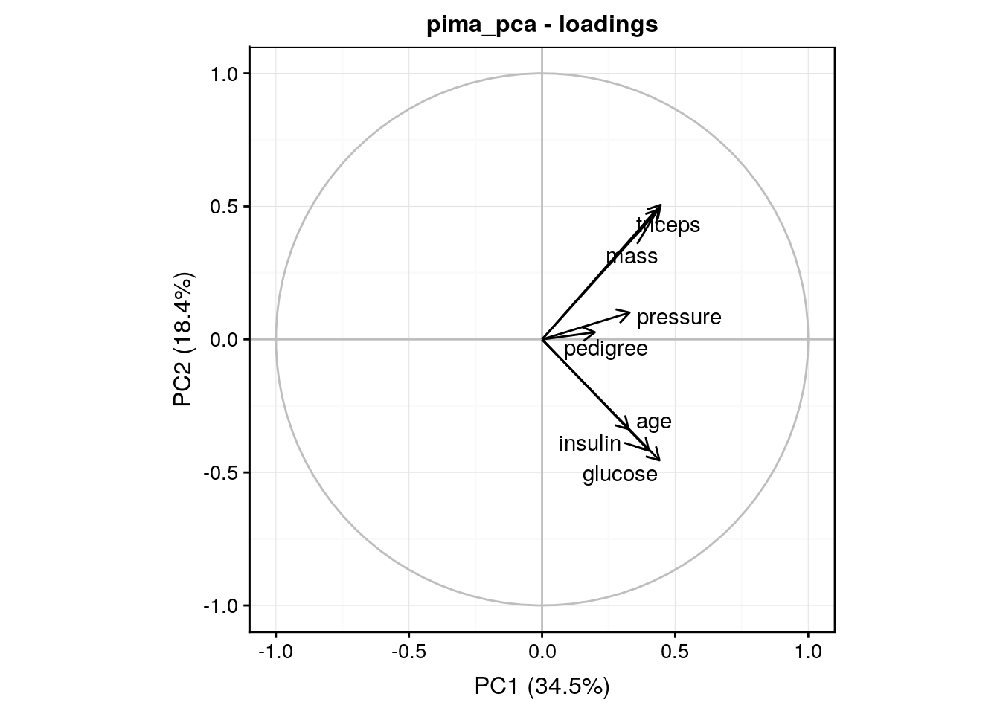
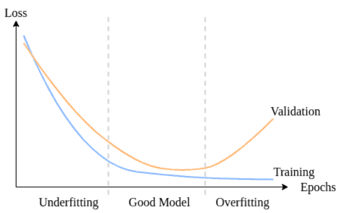

# Introduction to Machine Learning and Machine Learning techniques

Machine learning (ML) is a field of artificial intelligence (AI) that enables computers to learn from data without being explicitly programmed. Instead of following rigid instructions, machine learning algorithms adapt and improve their performance according to the data they are exposed to.\
This machine-learning capability is revolutionizing many sectors, including finance, healthcare, marketing and manufacturing. It enables computers to perform complex tasks previously considered the exclusive domain of humans, such as image recognition, natural language processing and autonomous decision-making.

## Machine learning techniques
Machine learning relies on a variety of techniques, each with its own strengths and weaknesses. The most common techniques include:

### Supervised learning {-}

Imagine you're teaching a friend how to identify flowers. You show them pictures with labels like "rose" or "daisy." This is similar to supervised machine learning.  The machine learns from data that already has the correct answers attached, like the flower labels. This way, it can recognize new flowers on its own later.\
Supervised machine learning is often used to create machine learning models used for prediction and classification purposes.\
Various algorithms are used in supervised machine learning processes.

&nbsp;&nbsp;&nbsp;&nbsp;1) Linear regression\
Linear regression is a fundamental supervised machine learning algorithm used for modeling the relationship between a dependent variable (what you want to predict) and one or more independent variables (what you're basing your prediction on).\
The goal of linear regression is to find the best-fitting line that minimizes the differences between the observed values and the values predicted by the linear model. This is typically done by minimizing the sum of the squared differences between the observed and predicted values.

&nbsp;&nbsp;&nbsp;&nbsp;2) Logistic regression\
Logistic regression is another supervised machine learning algorithm, but unlike linear regression, it's specifically designed for classification tasks where the dependent variable can only have a limited number of categories (usually two). \
Logistic regression doesn't directly output a classification. Instead, it calculates the probability of an observation belonging to a specific category.

&nbsp;&nbsp;&nbsp;&nbsp;3) Support vector machines\
A support vector machine (SVM) is a supervised machine learning algorithm that classifies data by finding an optimal line or hyperplane that maximizes the distance between each class in an N-dimensional space.
SVMs are capable of performing both linear and nonlinear classification tasks. In cases where the classes are not linearly separable, SVMs can map the input features into a higher-dimensional space using a technique called the kernel trick.

&nbsp;&nbsp;&nbsp;&nbsp;4) Decison trees\
Decision trees are a popular and intuitive supervised learning algorithm used for both classification and regression tasks in machine learning. They are a powerful tool for predictive modeling and are widely used in various domains due to their simplicity, interpretability, and flexibility.\
A decision tree is a hierarchical structure consisting of nodes and branches. Each internal node represents a decision based on the value of a certain feature, and each branch represents the possible outcomes of that decision. The leaf nodes of the tree represent the final predictions or decisions.\

&nbsp;&nbsp;&nbsp;&nbsp;5) Random forest\

Random Forest algorithm is a powerful tree learning technique in Machine Learning. It works by creating a number of Decision Trees during the training phase. Each tree is constructed using a random subset of the data set to measure a random subset of features in each partition. This randomness introduces variability among individual trees, reducing the risk of overfitting and improving overall prediction performance. In prediction, the algorithm aggregates the results of all trees, either by voting (for classification tasks) or by averaging (for regression tasks) This collaborative decision-making process, supported by multiple trees with their insights, provides an example stable and precise results.

&nbsp;&nbsp;&nbsp;&nbsp;6) K-Nearest Neighbors (KNN)\
The K-Nearest Neighbors (KNN) algorithm is a popular machine learning technique used for classification and regression tasks. It relies on the idea that similar data points tend to have similar labels or values.\
KNN classifies new data points based on their similarity to existing data points in the training set. It identifies the k nearest neighbors (data points) in the training data for a new data point and predicts the class label (for classification) or the average value (for regression) based on the majority vote (classification) or the average value (regression) of those neighbors.

  

### Semi-supervised learning {-}

Semi-supervised learning uses both unlabeled and labeled data sets to train algorithms. Typically, during machine semi-learning, algorithms are first fed with a small amount of labeled data to guide their development, and then with much larger amounts of unlabeled data to complete the model.

### Unsupervised learning {-}

In unsupervised learning, algorithms learn from an unlabeled data set, i.e. the data is not associated with pre-existing labels or categories. The aim is for the algorithm to discover hidden structures or patterns in the data.\
Unsupervised machine learning is often used by researchers and data scientists to identify patterns within large, unlabeled data sets quickly and efficiently.\
Some of the unsupervised learning algorithms are:

&nbsp;&nbsp;&nbsp;&nbsp;1) K-means:\

K-means is a popular unsupervised machine learning algorithm used for partitioning a dataset into a predefined number of groups (clusters). 

  

&nbsp;&nbsp;&nbsp;&nbsp;2) Principle Component Analysis (PCA):\

Principal component analysis (PCA) is a type of dimensionality reduction algorithm which is used to reduce redundancies and to compress datasets through feature extraction. This method uses a linear transformation to create a new data representation, yielding a set of "principal components." The first principal component is the direction which maximizes the variance of the dataset. While the second principal component also finds the maximum variance in the data, it is completely uncorrelated to the first principal component, yielding a direction that is perpendicular, or orthogonal, to the first component. This process repeats based on the number of dimensions, where a next principal component is the direction orthogonal to the prior components with the most variance.

  

&nbsp;&nbsp;&nbsp;&nbsp;3) Hierarchical clustering:\

Hierarchical clustering is an unsupervised learning technique used to group similar objects into clusters. It creates a hierarchy of clusters by merging or splitting them based on similarity measures.
Clustering Hierarchical groups similar objects into a dendrogram. It merges similar clusters iteratively, starting with each data point as a separate cluster. This creates a tree-like structure that shows the relationships between clusters and their hierarchy.

  

### Reinforcement learning {-}

In reinforcement learning, algorithms learn by interacting with an environment. The algorithm takes actions in the environment and receives rewards or penalties according to these actions. The aim is for the algorithm to learn to maximize its cumulative reward over time.\
Reinforcement learning is often used to create algorithms that must effectively make sequences of decisions or actions to achieve their aims, such as playing a game or summarizing an entire text. 

## Concepts of underfitting and overfitting\

In this part, we’ll focus on two terms in machine learning: overfitting and underfitting. These terms define a model’s ability to capture the relationship between input and output data. Both of them are possible causes of poor model performance.\
Overfitting happens when we train a machine learning model too much tuned to the training set. As a result, the model learns the training data too well, but it can’t generate good predictions for unseen data. An overfitted model produces low accuracy results for data points unseen in training, hence, leads to non-optimal decisions.\
About Underfitting it occurs when the machine learning model is not well-tuned to the training set. The resulting model is not capturing the relationship between input and output well enough. Therefore, it doesn’t produce accurate predictions, even for the training dataset. Resultingly, an underfitted model generates poor results that lead to high-error decisions, like an overfitted model.

### Detecting underfitting and overfitting 

&nbsp;&nbsp;&nbsp;&nbsp;- Detecting underfitting\
Usually, detecting underfitting is more straightforward than detecting overfitting. Even without using a test set, we can decide if the model is performing poorly on the training set or not. If the model accuracy is insufficient on the training data, it has high bias and hence, underfitting.

&nbsp;&nbsp;&nbsp;&nbsp;- Detecting overfitting\
As the number of epochs increases, the training accuracy typically increases. However, if the training accuracy continues to increase while the validation accuracy starts to decrease, this is an indication of overfitting.

### Cures for underfitting and overfitting 

&nbsp;&nbsp;&nbsp;&nbsp;1) Cures for underfitting\
To prevent underfitting we can:

- Use a model more complex
- Obtain more training data
- Increase number of features

&nbsp;&nbsp;&nbsp;&nbsp;2) Cures for overfittings\

To prevent overfitting we can:

- Reduce model complexity
- Reduce the number of input features
- use more training examples to train the model to generalize better.