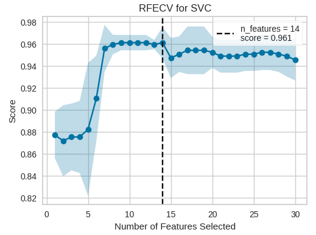
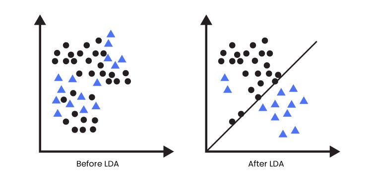

```{r include=FALSE, echo=FALSE}
source("./dependencies.R")
```


# Data preparation
Data preparation is a crucial step in the machine learning pipeline that involves cleaning, transforming, and pre-processing raw data to make it suitable for training and evaluation. This process ensures that the data is in a format that machine learning algorithms can effectively learn from, ultimately improving the performance and generalization ability of the models. By carefully preparing the data before feeding it into machine learning algorithms, practitioners can mitigate potential issues such as overfitting, improve model accuracy, and facilitate meaningful insights from the data.

## Data cleaning\
Data cleaning is an essential pre-processing step in machine learning that focuses on identifying and rectifying errors, inconsistencies, and inaccuracies in raw data. This process involves tasks such as handling missing values, removing duplicates, correcting data format inconsistencies, and dealing with outliers. Data cleaning ensures that the dataset is of high quality and integrity, which is crucial for building accurate and reliable machine learning models. By thoroughly cleaning the data, practitioners can enhance the quality of their analyses, improve model performance, and foster more meaningful insights from the data.
```{r}
#load the data
heart_attack <- read.csv("./data/heart_attack_prediction_dataset.csv")

#verify missing values
sum(is.na(heart_attack))

#remove irrelevant columns
heart_attack <- subset(heart_attack, select = -c(Patient.ID, Country, Continent,Hemisphere))

#check duplicates observations
table(duplicated(heart_attack))
```

## Feature creation\
Feature creation, also known as feature engineering, is a critical aspect of machine learning where new features are derived or constructed from existing ones to enhance model performance and capture more complex relationships in the data. This process involves transforming raw input data into a more informative representation that better captures the underlying patterns and structures. Feature creation techniques may include mathematical transformations like log transforms, creating interaction terms between existing features, binning numerical features into categorical ones or encoding categorical variables. Effective feature creation can significantly impact the predictive power of machine learning models, enabling them to better generalize to unseen data and achieve higher levels of accuracy and robustness.
```{r}
#feature creation
heart_attack[c('systolic_pressure', 'diastolic_pressure')] <- stringr::str_split_fixed(heart_attack$Blood.Pressure, '/', 2)

#convert the two columns in numeric
heart_attack$`systolic_pressure` <- as.numeric(heart_attack$systolic_pressure)
heart_attack$`diastolic_pressure` <- as.numeric(heart_attack$diastolic_pressure)

#remove the olds variable
heart_attack <- select(heart_attack, -Blood.Pressure)
```


## Feature scaling\
Feature scaling, is a technique used to transform numerical features in a dataset into a common scale. The goal is to bring the features to a similar magnitude, making them comparable and preventing any particular feature from dominating the learning algorithm due to its larger scale. Feature scaling is an essential preprocessing step in machine learning.
The most common methods for feature scaling are:

- Standardization: This method transforms the data to have zero mean and unit variance. It subtracts the mean and divides by the standard deviation of each feature. Standardization preserves the shape of the original distribution and is useful when the data does not have a normal distribution.

- Normalization: Normalization scales the data to a fixed range, typically between 0 and 1. It is achieved by subtracting the minimum value and dividing by the range (maximum value minus minimum value) of each feature. Normalization is suitable for data that has a bounded range and follows a uniform distribution.
```{r}
#load the data
breast_cancer <- read.csv("data/Breast_cancer_data.csv")

breast_cancer[,-6] <- scale(breast_cancer[,-6])

```


## Feature encoding

Feature encoding is a crucial step in machine learning where categorical variables are converted into numerical representations that algorithms can understand. Since many machine learning algorithms require numerical input, feature encoding transforms categorical data into a format that preserves the information contained in the original variables.\ 
Common techniques for feature encoding include one-hot encoding(it creates new (binary) columns, indicating the presence of each possible value from the original data), label encoding which assigns a unique numerical value to each category or ordinal encoding to ensure that ordinal nature of the variables is sustained.
```{r}
breast_cancer$diagnosis <- as.factor(breast_cancer$diagnosis)
str(breast_cancer$diagnosis)
```

## Data reduction

In machine learning, dimensionality reduction tackles the challenge of high-dimensional data. Imagine a vast landscape with many features representing different directions. Dimensionality reduction techniques condense the data into a lower-dimensional space while preserving the most important information. This not only simplifies analysis and visualization but also improves the performance of machine learning algorithms by reducing computational costs and the risk of overfitting. Dimensionnality techniques include feature selection and feature extraction.

1. Feature selection

&nbsp;&nbsp;&nbsp;- Correlation analysis:\
It identifies the degree of linear relationship between pairs of features, enabling the removal of highly correlated features to reduce redundancy and multicollinearity in the dataset.

```{r warning=FALSE, message=FALSE, fig.height=4, fig.align='center'}
library(ggcorrplot)
library(corrplot)
#Correlation matrix
corr <- cor(breast_cancer[,-6])

corrplot(corr, method = 'number', type = "upper")

```

&nbsp;&nbsp;&nbsp;- Recursive Feature Elimination:\
Feature selection refers to techniques that select a subset of the most relevant features for a dataset. It starts with a full set of features and iteratively eliminates the least important ones based on their impact on model performance. This process continues until the optimal subset of features is obtained.

<p align="center">
  
</p>

&nbsp;&nbsp;&nbsp;- Statistical tests:\
It utilizes statistical measures (e.g., t-tests, ANOVA) to assess the significance of individual features in relation to the target variable, facilitating the selection of features that significantly contribute to the predictive power of the model.

2. Feature extraction

&nbsp;&nbsp;&nbsp;- Principal Component Analysis (PCA):\
It reduces the dimensionality of the dataset by transforming correlated features into a smaller set of uncorrelated variables called principal components, capturing most of the variance in the data.

&nbsp;&nbsp;&nbsp;- Linear Discriminant Analysis (LDA):\
LDA finds new features (discriminant functions) that best separate different classes in your data. This helps focus the model on the key characteristics that differentiate the classes.
<p align="center">
  
</p>

## Handling imbalanced dataset
Imbalanced datasets occur when one class significantly outnumbers the other(s), leading to biased model training and poor generalization performance. 
We can handle imbalanced dataset by applying undersampling, oversampling or the method SMOTE.

1. undersampling:\
The process of undersampling counts the number of minority samples in the dataset, then randomly selects the same number from the majority sample.
```{r}
#load the package
library(ROSE)

#load the data
stroke_data <- read.csv("./data/stroke.csv")

#verify imbalance on the target variable
table(stroke_data$stroke)

# balanced data set with both over and under sampling
stroke_undersample <- ovun.sample(stroke~., data=stroke_data,
                                  N=nrow(stroke_data), p=0.5, 
                                  seed=1, method="both")$data

#reverify the distribution of the target variable
table(stroke_undersample$stroke)

```


2. oversampling:\
This method repeatedly duplicates randomly selected minority classes until there are an equal number of majority and minority samples.

```{r}
# balanced data set with over-sampling
stroke_oversample <- ovun.sample(stroke~., data=stroke_data, 
                                  p=0.5, seed=1, 
                                  method="over")$data

table(stroke_oversample$stroke)
```
3. SMOTE(Synthetic Minority Oversampling Technique):\
A very simple explanation is that it randomly selects a minority data point and looks at its nearest k minority class neighbours. It then randomly selects one of these neighbours, draws a line between them and creates a new data point randomly along that line. This will be repeated until the minority class has reached a predetermined ratio to the majority class.
```{r}
library(DMwR)

data(iris)
data <- iris[, c(1, 2, 5)]
data$Species <- factor(ifelse(data$Species == "setosa","rare","common")) 
## checking the class distribution of this artificial data set
table(data$Species)

## now using SMOTE to create a more "balanced problem"
data_smote <- SMOTE(Species ~ ., data, perc.over = 600,perc.under=100)
table(data_smote$Species)
```


