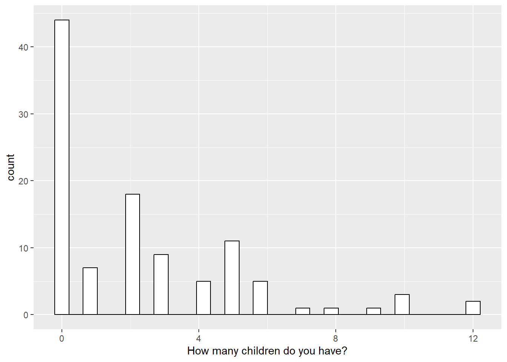
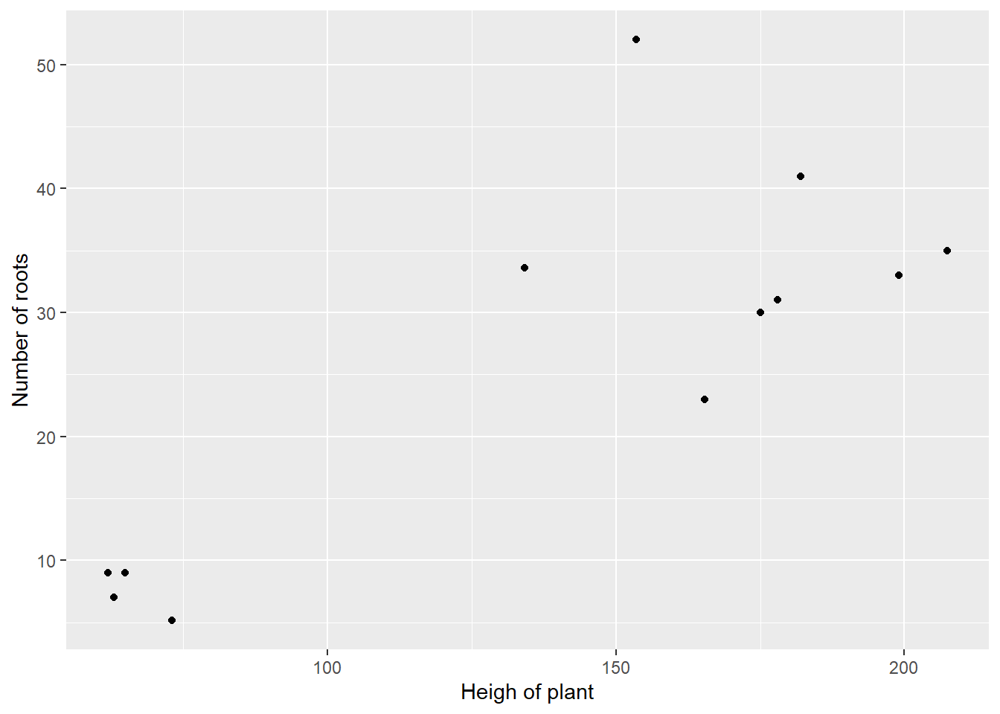
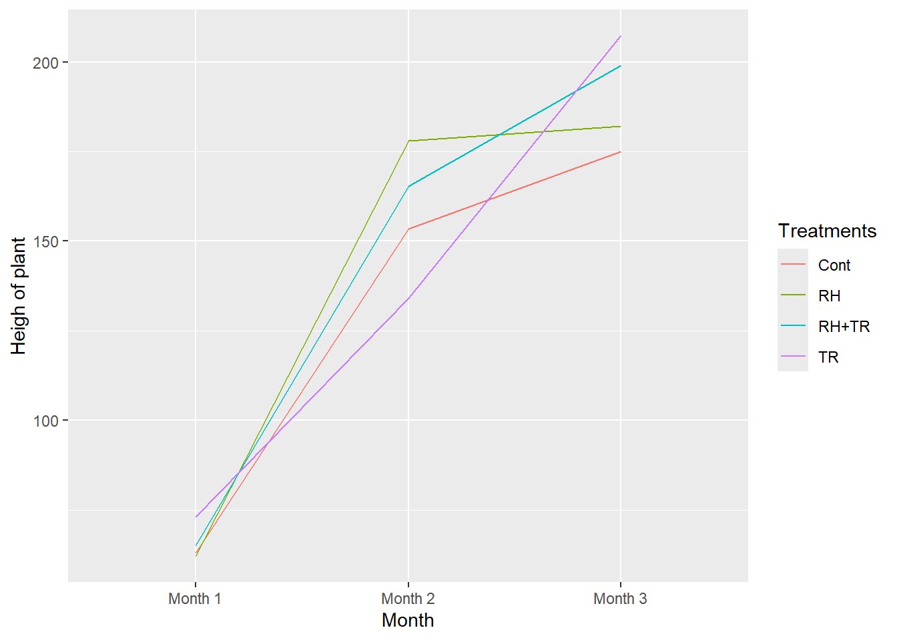

# Visualization

## Bar chart
A bar chart is a representation of numerical data in pictorial form of rectangles (or bars) having uniform width and varying heights." They are also known as bar graphs.


```r
#construction of the dataframe
data_barchart <- as.data.frame(table(data_1$`What is your religion?`))
data_barchart <- data_barchart %>%
    dplyr::mutate(percentage = round(100*(Freq/sum(Freq)),2),
                  pct1 = paste0(percentage, "%")) %>%
  rename(Religion=Var1)


#plot the bar chart
plotly::plot_ly(data_barchart, x = ~Religion,
                  type = "bar",
                  y = ~percentage,
                  marker = list(color = "#318CE7"),
                  text = paste(data_barchart$pct1, sep = ""), textposition = 'outside') %>%
    layout(title = "Number of persons by religion"
    )
```


```{=html}
<div class="plotly html-widget html-fill-item" id="htmlwidget-7e7a63de85469889aad5" style="width:672px;height:480px;"></div>
<script type="application/json" data-for="htmlwidget-7e7a63de85469889aad5">{"x":{"visdat":{"50a84a065a5f":["function () ","plotlyVisDat"]},"cur_data":"50a84a065a5f","attrs":{"50a84a065a5f":{"x":{},"y":{},"marker":{"color":"#318CE7"},"text":["0.93%","28.04%","13.08%","1.87%","56.07%"],"textposition":"outside","alpha_stroke":1,"sizes":[10,100],"spans":[1,20],"type":"bar"}},"layout":{"margin":{"b":40,"l":60,"t":25,"r":10},"title":"Number of persons by religion","xaxis":{"domain":[0,1],"automargin":true,"title":"Religion","type":"category","categoryorder":"array","categoryarray":["Adventist","Catholic","Muslim","pentecostal","Protestant"]},"yaxis":{"domain":[0,1],"automargin":true,"title":"percentage"},"hovermode":"closest","showlegend":false},"source":"A","config":{"modeBarButtonsToAdd":["hoverclosest","hovercompare"],"showSendToCloud":false},"data":[{"x":["Adventist","Catholic","Muslim","pentecostal","Protestant"],"y":[0.93000000000000005,28.039999999999999,13.08,1.8700000000000001,56.07],"marker":{"color":"#318CE7","line":{"color":"rgba(31,119,180,1)"}},"text":["0.93%","28.04%","13.08%","1.87%","56.07%"],"textposition":["outside","outside","outside","outside","outside"],"type":"bar","error_y":{"color":"rgba(31,119,180,1)"},"error_x":{"color":"rgba(31,119,180,1)"},"xaxis":"x","yaxis":"y","frame":null}],"highlight":{"on":"plotly_click","persistent":false,"dynamic":false,"selectize":false,"opacityDim":0.20000000000000001,"selected":{"opacity":1},"debounce":0},"shinyEvents":["plotly_hover","plotly_click","plotly_selected","plotly_relayout","plotly_brushed","plotly_brushing","plotly_clickannotation","plotly_doubleclick","plotly_deselect","plotly_afterplot","plotly_sunburstclick"],"base_url":"https://plot.ly"},"evals":[],"jsHooks":[]}</script>
```


## Pie chart
A pie chart is a type of graph representing data in a circular form, with each slice of the circle representing a fraction or proportionate part of the whole.


```r
#construction of the dataframe
data_piechart <- as.data.frame(table(data_1$Sex))
data_piechart <- data_piechart %>%
    dplyr::mutate(percentage = round(100*(Freq/sum(Freq)),2),
                  pct1 = paste0(percentage, "%"))

#plot the pie chart
plotly::plot_ly(data_piechart, labels= ~Var1,
          values= ~Freq, type="pie",
          hoverinfo = 'text',
          textinfo = 'label+percent',
          insidetextfont = list(color = '#FFFFFF'),
          text = ~paste("Sex :",Var1,
                        "<br>Number of persons :", Freq,
                        "<br>Percentage :", pct1),
          marker = list(colors = c("#318CE7", "#89CFF0"),
                        line = list(color = '#FFFFFF', width = 1),showlegend = FALSE)) %>%
    layout(title="",
           xaxis = list(showgrid = FALSE, zeroline = FALSE, showticklabels = FALSE),
           yaxis = list(showgrid = FALSE, zeroline = FALSE, showticklabels = FALSE))
```


```{=html}
<div class="plotly html-widget html-fill-item" id="htmlwidget-48059beac8bf4517b748" style="width:672px;height:480px;"></div>
<script type="application/json" data-for="htmlwidget-48059beac8bf4517b748">{"x":{"visdat":{"50a847bb1373":["function () ","plotlyVisDat"]},"cur_data":"50a847bb1373","attrs":{"50a847bb1373":{"labels":{},"values":{},"hoverinfo":"text","textinfo":"label+percent","insidetextfont":{"color":"#FFFFFF"},"text":{},"marker":{"colors":["#318CE7","#89CFF0"],"line":{"color":"#FFFFFF","width":1},"showlegend":false},"alpha_stroke":1,"sizes":[10,100],"spans":[1,20],"type":"pie"}},"layout":{"margin":{"b":40,"l":60,"t":25,"r":10},"title":"","xaxis":{"showgrid":false,"zeroline":false,"showticklabels":false},"yaxis":{"showgrid":false,"zeroline":false,"showticklabels":false},"hovermode":"closest","showlegend":true},"source":"A","config":{"modeBarButtonsToAdd":["hoverclosest","hovercompare"],"showSendToCloud":false},"data":[{"labels":["Female","Male"],"values":[58,49],"hoverinfo":["text","text"],"textinfo":"label+percent","insidetextfont":{"color":"#FFFFFF"},"text":["Sex : Female <br>Number of persons : 58 <br>Percentage : 54.21%","Sex : Male <br>Number of persons : 49 <br>Percentage : 45.79%"],"marker":{"color":"rgba(31,119,180,1)","colors":["#318CE7","#89CFF0"],"line":{"color":"#FFFFFF","width":1},"showlegend":false},"type":"pie","frame":null}],"highlight":{"on":"plotly_click","persistent":false,"dynamic":false,"selectize":false,"opacityDim":0.20000000000000001,"selected":{"opacity":1},"debounce":0},"shinyEvents":["plotly_hover","plotly_click","plotly_selected","plotly_relayout","plotly_brushed","plotly_brushing","plotly_clickannotation","plotly_doubleclick","plotly_deselect","plotly_afterplot","plotly_sunburstclick"],"base_url":"https://plot.ly"},"evals":[],"jsHooks":[]}</script>
```


## Histogram
A histogram is a chart that plots the distribution of a numeric variable’s values as a series of bars. Each bar typically covers a range of numeric values called a bin or class; a bar’s height indicates the frequency of data points with a value within the corresponding bin.

```r
library(ggplot2)

# Change colors
p<-ggplot(data_1, aes(x=`How many children do you have?`)) + 
  geom_histogram(color="black", fill="white")
p
#> `stat_bin()` using `bins = 30`. Pick better value with
#> `binwidth`.
```




## Scatter plot\
A scatter plot (or scatter chart, scatter graph) uses dots to represent values for two different numeric variables. The position of each dot on the horizontal and vertical axis indicates values for an individual data point. Scatter plots are used to observe relationships between variables.

```r
time_series <- readxl::read_excel("./data/data_for_workshop2.xls", sheet = "times_series")
ggplot(time_series, aes(x = `Heigh of plant`,
                   y = `Number of roots`)) +
geom_point()
```




## Line chart\
A line chart, also known as a line graph, is a visual representation of data that displays information as a series of data points connected by straight line segments. Line charts are commonly used to show trends or changes over time, making them particularly useful for illustrating temporal patterns or relationships in data. Line charts provide a clear and intuitive way to visualize how values evolve or fluctuate over a specific period. 

```r
ggplot(time_series, aes(x = Month, y = `Heigh of plant`,color = Treatments,group = Treatments)) +
  geom_line()
```




## Map visualization
