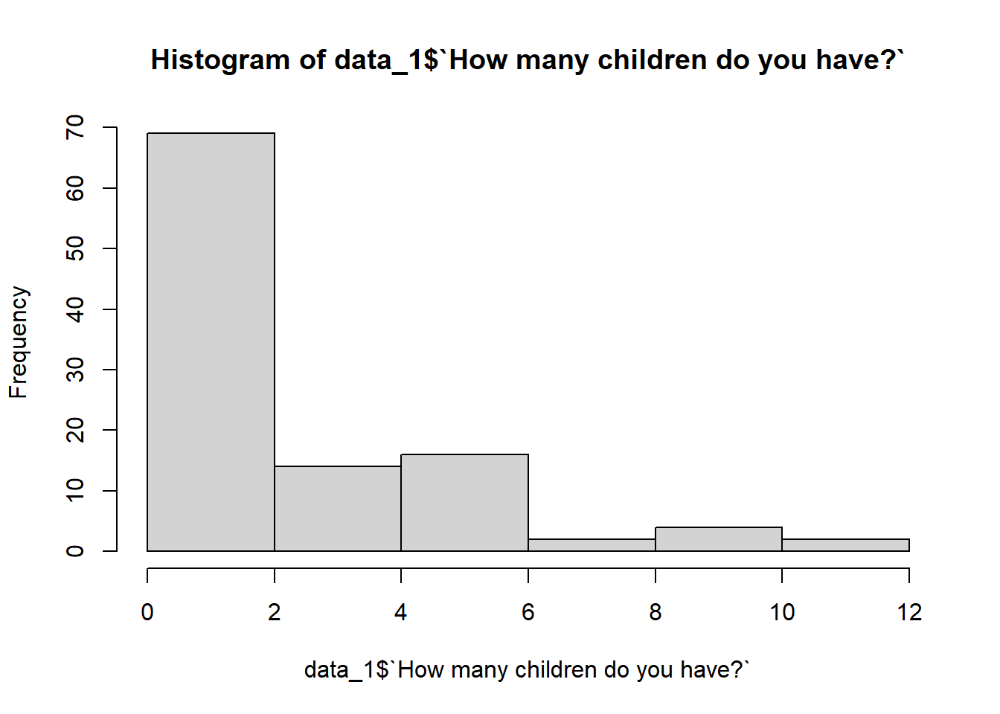

# Data manipulation

Data manipulation involves modifying data to make it easier to read and to be more organized. We manipulate data for analysis and visualization. At times, the data collection process done by machines involves a lot of errors and inaccuracies in reading. Data manipulation is also used to remove these inaccuracies and make data more accurate and precise.

## Importation of data
Data import is an essential step in the data analysis process. It involves retrieving data from various sources, such as local files, databases, APIs or real-time feeds. This step acquires the data needed for analysis and decision-making, and is often the starting point for analytical work.

In this part, we will learn to load commonly used **CSV**, **Excel**, **JSON**, **Database**, and **XML/HTML** data files in R. Moreover, we will also look at less commonly used file formats such as **SPSS** and **Stata**. 

Importing data from csv to R:

```r
#load data
breast_cancer <- read.csv("./data/Breast_cancer_data.csv")
```

Importing data from excel to R:

```r
#load package
library(readxl)

#load data
tasba_data <- readxl::read_excel("./data/data_for_workshop1.xls")
head(tasba_data)
#> # A tibble: 6 × 42
#>   Sex    Age       `Are you married?` Do you  have childre…¹
#>   <chr>  <chr>     <chr>              <chr>                 
#> 1 Male   25_40 ye… NO                 NO                    
#> 2 Male   15_25 ye… NO                 NO                    
#> 3 Male   25_40 ye… NO                 NO                    
#> 4 Male   15_25 ye… NO                 NO                    
#> 5 Female 15_25 ye… NO                 NO                    
#> 6 Male   25_40 ye… NO                 NO                    
#> # ℹ abbreviated name: ¹​`Do you  have children?`
#> # ℹ 38 more variables:
#> #   `How many children do you have?` <dbl>,
#> #   `What is your religion?` <chr>,
#> #   `Do have a tasba farm?` <chr>,
#> #   `What's the size of your farm?` <chr>,
#> #   `How long have you been growing tasba?` <chr>, …
```


Importing data from json to R:

```r
#load package
library(jsonlite)

#load data
json_data <- jsonlite::fromJSON("./data/sample4.json")

#transform data into dataframe
as.data.frame(json_data)
```


Importing data from database to R:

```r
#load package
library(RSQLite)

#establish the connection to the database
conn <- dbConnect(RSQLite::SQLite(), "./data/mental_health.sqlite")

#list names of all the tables in the database
dbListTables(conn)
#> [1] "Answer"   "Question" "Survey"
```

```r
#retrieve data from table Question
sqlite_data <- dbGetQuery(conn, "SELECT * FROM Survey")
head(sqlite_data)
#>   SurveyID                   Description
#> 1     2014 mental health survey for 2014
#> 2     2016 mental health survey for 2016
#> 3     2017 mental health survey for 2017
#> 4     2018 mental health survey for 2018
#> 5     2019 mental health survey for 2019
```


Importing data from spss to R:

```r
#load package
library(haven)

#load data
spss_data <- haven::read_sav("./data/mental_health.sav")
head(spss_data)
#> # A tibble: 6 × 14
#>   `CASE#` GENDER  HOME   AGE    EB    PH    CS    ER   TRO
#>     <dbl>  <dbl> <dbl> <dbl> <dbl> <dbl> <dbl> <dbl> <dbl>
#> 1      42      1     0    59    NA    NA    NA    32    25
#> 2      37      0     0    58     2     2    NA    25    19
#> 3     141      0     0    83    NA     2     2    31    32
#> 4     143      0     0    85     2     3    NA    18    25
#> 5     128      1     0    75    14     8    21    20    19
#> 6      12      1     0    50    17     9    27    28    26
#> # ℹ 5 more variables: MOB <dbl>, SS <dbl>, CESD <dbl>,
#> #   SelfEsteem <dbl>, Satisfaction <dbl>
```

Importing data from stata to R:

```r
#load data
stata_data <- haven::read_dta("./data/SMOKE.DTA")
head(stata_data)
#> # A tibble: 6 × 10
#>    educ cigpric white   age income  cigs restaurn lincome
#>   <dbl>   <dbl> <dbl> <dbl>  <dbl> <dbl>    <dbl>   <dbl>
#> 1  16      60.5     1    46  20000     0        0    9.90
#> 2  16      57.9     1    40  30000     0        0   10.3 
#> 3  12      57.7     1    58  30000     3        0   10.3 
#> 4  13.5    57.9     1    30  20000     0        0    9.90
#> 5  10      58.3     1    17  20000     0        0    9.90
#> 6   6      59.3     1    86   6500     0        0    8.78
#> # ℹ 2 more variables: agesq <dbl>, lcigpric <dbl>
```


## Basic exploration of data

Data exploration helps you explore and think about the data you're working. The goal with data exploration is to understand,  and visualize data so that you can discover insights, relationships, patterns, and anomalies.
To explore data in R we have many functions to achieve that.

+ Function head(): is used to view the first few rows of your dataset.

```r
head(tasba_data,3)
```


+ Function tail(): is used to view the last few rows of your dataset.

```r
tail(tasba_data)
```


+ Function str(): is used to provide the structure of your data frame, showing you the data types.

```r
str(tasba_data)
```


+ Function dim(): is used to know about the number of rows and columns.

```r
dim(tasba_data)
#> [1] 107  42
```


+ Function summary(): it gives you an overview of your data, including minimum and maximum values, quartiles, and more.

```r
summary(tasba_data)
```


+ Function table(): used to build a contingency table of the counts at each combination of factor levels.

```r
table(tasba_data$Sex)
#> 
#> Female   Male 
#>     58     49
```


+ Function unique(): The unique() function in R is used to eliminate or delete the duplicate values or the rows present in the vector, data frame, or matrix as well.

```r
unique(tasba_data$`Do you  have children?`)
#> [1] "NO"  "YES"
```

+ Function hist(): function to plot a basic histogram to view distribution of a variable.

```r
hist(tasba_data$`How many children do you have?`,
     xlab = 'Number of childrens',
     main = 'Number of childrens')
```




+ Function boxplot(): function to plot a boxplot, it provides a compact summary of the data's central tendency, spread, and potential outliers.


```r
boxplot(tasba_data$`How many children do you have?`)
```


## Data manipulation with dplyr

**IMPORTANT POINT:**
One of the more useful ways to use dplyr is with the pipe operator. The pipe operator looks like this: %>% ,and it is common practice to use the pipe operator to “pipe” dplyr commands together. It is a way to chain multiple operations together in a concise and precise way. The %>% operator takes the output of the expression on its left and passes it as the first argument to the function on its right.

In order to manipulate and clean the data, R provides a library called dplyr which consists of many built-in methods to manipulate the data. So to use the data manipulation function, first need to import the dplyr package using library(dplyr) line of code. Below is the list of fundamental data manipulation verbs that you will use to do most of your data manipulations.

+ filter(): 

  The filter() function is used to produce the subset of the data that satisfies the condition specified in the filter() method. In the condition, we can use conditional operators, logical operators, NA values, range operators etc. to filter out data. Syntax of filter() function is given below:

        filter(dataframeName,condition)
        
Example:

```r
dplyr::filter(tasba_data, Sex=="Female")
```

+ distinct(): 

  The distinct() method removes duplicate rows from data frame or based on the specified columns. The syntax of distinct() method is given below:
  
        distinct(dataframeName, col1, col2,.., .keep_all=TRUE)
        
Example:

```r
tasba_data %>% 
  dplyr::distinct()
```


+ arrange():

  In R, the arrange() method is used to order the rows based on a specified column. The syntax of arrange() method is specified below:
  
        arrange(dataframeName, columnName)
        
Example:

```r
tasba_data %>% 
  dplyr::arrange(Sex)
```


+ select():

  The select() method is used to extract the required columns as a table by specifying the required column names in select() method. The syntax of select() method is mentioned below:
        
        select(dataframeName, col1,col2,…)
        
Example:

```r
tasba_data %>% 
  dplyr::select(Sex,`Do you  have children?`)
```


+ rename():

  The rename() function is used to change the column names. This can be done by the below syntax:
  
        rename(dataframeName, newName=oldName)
        
Example:

```r
tasba_data %>%
  dplyr::rename(Status= `Are you married?`)
```


+ mutate():

  The mutate() function creates new variables without dropping the old ones. The syntax of mutate() is specified below:
  
        mutate(dataframeName, newVariable=formula)
        
Example:

```r
tasba_data %>%
  dplyr::mutate(sex=ifelse(Sex=="Female", "F", "M"))
```


+ transmute():

  The transmute() function drops the old variables and creates new variables. Here is the syntax:
  
        transmute(dataframeName, newVariable=formula)
        
Example:

```r
tasba_data %>%
  dplyr::transmute(sex=ifelse(Sex=="Female", "F", "M"))
```


+ summarize():

  Using the summarize method we can summarize the data in the data frame by using aggregate functions like sum(), mean(), etc. Usually this function is used with the `group_by()` function. The syntax of summarize() method is specified below:
  
        summarize(dataframeName, aggregate_function(columnName))
        
Example:

```r
tasba_data %>%
  group_by(Sex) %>%
  summarize(mean=mean(`How many children do you have?`), count=n())
```
